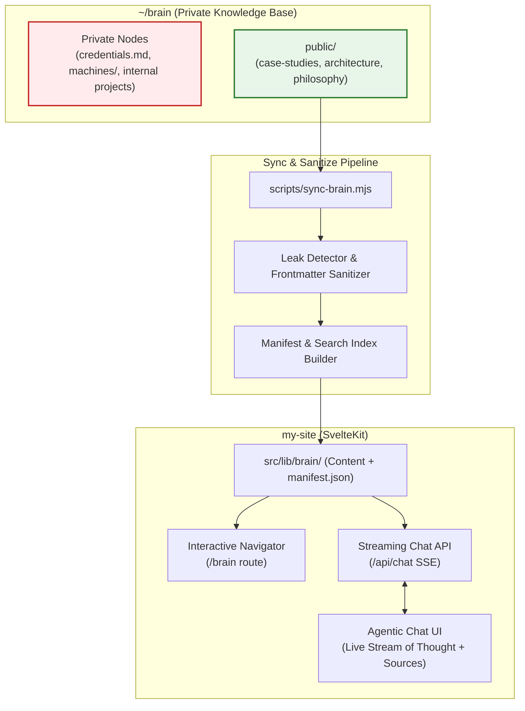

# Architecture & Implementation Plan: Public Brain & Streaming Agentic Chat

## 1. Executive Summary

This plan outlines the architecture and phased roadmap to transform **my-site** (`andy-engineer.vercel.app`) from a static context-injected portfolio into a live **agentic showcase** driven by a public knowledge base ("Public Brain").

### Key Objectives
1. **Curated Public Knowledge in `~/brain`**: Establish a top-level `public/` directory in your existing `~/brain` repository tailored for public technical evaluation (case studies, architecture deep-dives, engineering philosophies), completely isolated from private machine/operational directives.
2. **Deterministic Sync Pipeline**: Create a secure, automated pipeline in `my-site` to pull, sanitize, and validate public brain notes into `src/lib/brain/` with zero risk of leaking private data.
3. **Interactive Public Navigator**: Build a fast, elegant "Digital Garden" UI on the site (`/brain`) where human visitors (recruiters, founders, engineers) can browse, search, and deep-link into technical notes.
4. **Streaming Agentic Recruiter Assistant**: Upgrade `/api/chat` to an SSE (Server-Sent Events) endpoint where Google Gemini (`gemini-3.1-flash-lite-preview` or `gemini-2.5-flash`) actively navigates the public brain via function-calling tools, streaming both its **stream-of-thought** reasoning steps and tool-call actions directly into the chat interface.



---

## 2. Component 1: The Public Brain (`~/brain/public/`)

### Design Philosophy
Unlike the root `~/brain`, which serves as an operational notebook for machine setups, deployment traps, and credentials, the **public brain** serves as a **portfolio of engineering rigor**. It is organized for readability, technical authority, and discovery.

### Proposed Directory Structure
```
~/brain/
├── INDEX.md                         # Root brain index (points to public/INDEX.md)
├── credentials.md                   # PRIVATE (never synced)
├── machines/                        # PRIVATE (never synced)
├── projects/                        # PRIVATE / internal notes
└── public/                          # PUBLIC TOP-LEVEL NODE
    ├── INDEX.md                     # Curated directory with high-level domains
    ├── case-studies/                # Project deep-dives focusing on technical complexity
    │   ├── cruffled.md              # Crossword engine, dynamic grid mapping, applet IIFE
    │   ├── weatherie.md             # Polymorphic dynamic UI, WASM post-processing
    │   ├── foundry.md               # Multi-agent financial POC, AG-UI WebSockets, MCP
    │   ├── gametsunami.md           # Sandboxed iframe bridge, 15-step agentic Vercel AI loop
    │   └── tackry.md                # Local-first Room DB, live Android notification hooks
    ├── architecture/                # System designs & reusable patterns
    │   ├── agent-ui-protocols.md    # Real-time UI streaming, envelope protocols, action triggers
    │   ├── local-first-android.md   # Room persistence, Android Bubbles, background enrichment
    │   └── serverless-media.md      # Edge transcoding, asset strip pipelines
    └── philosophy/                  # Technical & Product Leadership
        ├── product-engineering.md   # Zero-to-one engineering vs feature factory
        └── agentic-workflows.md     # Moving beyond text generation to autonomous tool loops
```

### Node Frontmatter Specification
Every file under `public/` must adhere to a strict schema:
```markdown
---
slug: case-studies/foundry
title: Autonomic Alpha Foundry: Multi-Agent Architecture
category: case-studies
description: Multi-agent financial POC using Microsoft Agent Framework, MCP servers, and WebSocket AG-UI.
tags: [multi-agent, mcp, sveltekit, websockets, python, fast-api]
featured: true
updated: 2026-09-09
---
```

### Privacy Boundary & Safety Invariants
1. **Directory-level quarantine**: The sync pipeline *only* accesses paths starting with `/public/`.
2. **Content sanitization**: Automated regex checks fail the build if IP addresses, `.env` patterns, private machine names (`hel`, `nur`, `xps`, `mac`), or credential keywords appear in public notes.
3. **No relative upward links**: Relative links in public markdown files cannot traverse up to `../machines/` or root notes.

---

## 3. Component 2: Sync & Ingestion Pipeline

### Sync Script: `my-site/scripts/sync-brain.mjs`
A deterministic Node.js script executed via `npm run sync:brain`.

```javascript
// Workflow:
// 1. Resolve brain location (default ~/brain/public or env BRAIN_PUBLIC_PATH)
// 2. Validate all source files against the privacy boundary & frontmatter schema
// 3. Clean target directory: src/lib/brain/
// 4. Copy sanitized markdown files
// 5. Build src/lib/brain/manifest.json containing:
//    - slugs, titles, descriptions, categories, tags, updated dates
//    - word counts and reading times
//    - lightweight search index (for client-side instant search)
```

### Resulting Artifact in `my-site`
```
my-site/
└── src/
    └── lib/
        └── brain/
            ├── manifest.json       # Precomputed registry for instant tool/client search
            ├── INDEX.md
            ├── case-studies/
            ├── architecture/
            └── philosophy/
```

### Vercel Deployment Safety
- The copied markdown and `manifest.json` are committed into `my-site`'s repository.
- **Benefits**:
  - Vercel deployments remain 100% self-contained (no external Git clones, API tokens, or network calls at build time).
  - Production serverless functions read from local disk / imports in **0 ms**.

---

## 4. Component 3: Interactive Public Navigator (`/brain`)

Provide a first-class reading experience so visitors who prefer reading over AI chat can explore your technical thinking.

### Route Hierarchy in SvelteKit
```
src/routes/
└── brain/
    ├── +page.svelte                 # Digital Garden hub: category tabs, tag filters, search bar
    ├── +page.server.js              # Loads manifest.json
    └── [...slug]/
        ├── +page.svelte             # Full markdown reader with code highlighting & TOC
        └── +page.server.js          # Loads the specific node markdown file
```

### UI Features
- **Instant Search & Filter**: Real-time filtering by category (`Case Studies`, `Architecture`, `Philosophy`) and tag pills (`#multi-agent`, `#sveltekit`, `#wasm`).
- **Markdown Presentation**:
  - Clean typographic hierarchy matching the existing dark/modern site aesthetic.
  - Interactive code blocks with syntax highlighting and copy buttons.
  - Rendered Mermaid diagrams.
  - Sticky table of contents for long technical notes.
- **Cross-Referencing**:
  - Automatic backlinks ("Related Case Studies", "Relevant Architecture Notes").
  - Deep-linkable anchor headings.

---

## 5. Component 4: Streaming Agentic Chat with Stream-of-Thought

Upgrade the conversational recruiter assistant from a single-shot prompt into a tool-calling, multi-step agent with visible reasoning.

### The Problem with the Current Approach
Currently, `api/chat/+server.js` bundles every `.md` and `.json` file in `src/lib/context/` into the system prompt. This creates:
- High prompt token cost per turn.
- Attention dilution across diverse topics.
- Inability to scale to dozens of detailed architectural notes.
- A "black box" user experience where the user waits 3+ seconds in silence.

### The Agentic Solution: Tool Calling + Thinking Stream

#### 1. Available Agent Tools
Gemini is provided with two lightweight navigation tools:
- **`search_knowledge_index`**: Takes `{ query?: string, category?: string, tag?: string }`. Returns matching entries from `manifest.json` (title, slug, 1-line description).
- **`read_knowledge_node`**: Takes `{ slug: string }`. Returns the full markdown body of the selected node.

#### 2. Model Configuration
- **Model**: `gemini-2.5-flash` or `gemini-3.1-flash-lite-preview`.
- **Thinking Budget**: Enable native thinking to capture chain-of-thought tokens.

#### 3. SSE Protocol (`/api/chat` endpoint)
The server converts the client `POST` into an SSE stream (`Content-Type: text/event-stream`):

| SSE Event | Payload | Purpose |
| :--- | :--- | :--- |
| `thought` | `{"delta": "Recruiter is asking about real-time protocols..."}` | Streams model's internal reasoning |
| `tool_call` | `{"tool": "search_knowledge_index", "args": {"tag": "streaming"}}` | Tells UI the agent initiated a lookup |
| `tool_result`| `{"tool": "search_knowledge_index", "found": ["foundry", "agent-ui-protocols"]}` | Shows tool resolution |
| `tool_call` | `{"tool": "read_knowledge_node", "args": {"slug": "case-studies/foundry"}}` | Agent drills into target node |
| `tool_result`| `{"tool": "read_knowledge_node", "status": "loaded"}` | Node loaded into agent context |
| `content` | `{"delta": "Actually, Andrea architected a custom event envelope..."}` | Streams final synthesized answer |
| `done` | `{"sources": [{"title": "Autonomic Alpha Foundry", "slug": "case-studies/foundry"}]}` | Completed response with citation links |

#### 4. Frontend UI: Transparent Stream-of-Thought
In `src/lib/components/chat/ChatMessageItem.svelte`:

```
┌──────────────────────────────────────────────────────────────┐
│ Andrea's Assistant                                           │
│                                                              │
│ 💭 Thought Process (Live / Collapsible)                      │
│    ├ Analyzing recruiter query: real-time streaming          │
│    ├ 🔍 Searched brain index for: [streaming, websockets]    │
│    └ 📖 Read node: case-studies/foundry.md                   │
│                                                              │
│ Actually, Andrea architected a custom event-envelope         │
│ protocol over WebSockets for the Alpha Foundry platform,     │
│ enabling real-time multi-agent state synchronization with     │
│ reactive SvelteKit widgets.                                  │
│                                                              │
│ 📄 Sources:                                                  │
│   • 🔗 [Autonomic Alpha Foundry Architecture](/brain/case-studies/foundry) │
│                                                              │
│ Would you like to know more about the WebSocket state        │
│ synchronization or how approval gates were handled?          │
└──────────────────────────────────────────────────────────────┘
```

- While executing, the thought card shows an active shimmer/pulse.
- Once the message completes, the thought block collapses into an elegant summary pill (`⚡ Reasoned across 1 brain node in 1.1s (click to inspect)`).
- Sources link directly to the `/brain/[...slug]` routes created in Component 3!

---

## 6. Phased Implementation Roadmap

When you pick this up in a graduated permission session, we can execute along these 4 discrete phases:

### Phase 1: Establish `~/brain/public/` & Core Case Studies
- [ ] Create `~/brain/public/INDEX.md` and category directories (`case-studies/`, `architecture/`, `philosophy/`).
- [ ] Port and expand existing high-value context into public nodes:
  - `case-studies/cruffled.md`
  - `case-studies/weatherie.md`
  - `case-studies/foundry.md`
  - `case-studies/gametsunami.md`
  - `case-studies/tackry.md`
  - `architecture/agent-ui-protocols.md`
  - `philosophy/product-engineering.md`
- [ ] Add frontmatter and test index consistency.
- [ ] Commit and push to `origin/master` on `~/brain`.

### Phase 2: Ingestion & Sync Pipeline
- [ ] Create `my-site/scripts/sync-brain.mjs`.
- [ ] Implement validator: assert no paths outside `public/`, strip any sensitive markers.
- [ ] Implement `manifest.json` builder (with search keywords, metadata, word count).
- [ ] Add `sync:brain` script to `my-site/package.json`.
- [ ] Run sync and verify `src/lib/brain/` contents and manifest integrity.

### Phase 3: Interactive `/brain` Explorer in `my-site`
- [ ] Create route `src/routes/brain/+page.svelte` (Hub view with search, category tabs, tag filters).
- [ ] Create route `src/routes/brain/[...slug]/+page.svelte` (Individual note reader with markdown rendering).
- [ ] Add navigation links in site header/footer to explore the Brain.
- [ ] Ensure mobile responsive layout and dark mode styling parity.

### Phase 4: Streaming Agentic Chat with Stream-of-Thought
- [ ] Refactor `src/routes/api/chat/+server.js` to SSE streaming:
  - Integrate Gemini tool definitions (`search_knowledge_index`, `read_knowledge_node`).
  - Wire tool-execution loop against `src/lib/brain/manifest.json` and node files.
  - Stream `thought`, `tool_call`, `tool_result`, and `content` chunks.
- [ ] Upgrade frontend chat client (`ChatModal.svelte`, `ChatMessageItem.svelte`):
  - Add SSE reader supporting chunked events.
  - Implement collapsible `Thinking...` component with real-time step visualization.
  - Render interactive source citation pills linking to `/brain/[...slug]`.
  - Retain existing AG-UI triggers (`[ACTION:SHOW_CONTACT_FORM]`) and Telegram alert logging (`/api/log`).

---

## 7. Verification & Safety Checklist

Before production release on Vercel:
- [ ] **Leak Test**: Automated script scans `src/lib/brain/` for regex matches against private keywords, server IPs, and keystore references.
- [ ] **Latency Test**: Verify agentic tool-calling loop completes within $\le 1.2\text{s}$ using `gemini-3.1-flash-lite-preview` or `gemini-2.5-flash`.
- [ ] **Offline / Vercel Build Test**: Ensure `npm run build` succeeds purely from committed files with zero network dependencies.
- [ ] **Fallback Behavior**: Ensure chat gracefully answers general questions if no specific node needs to be opened, without forcing unnecessary tool calls.
